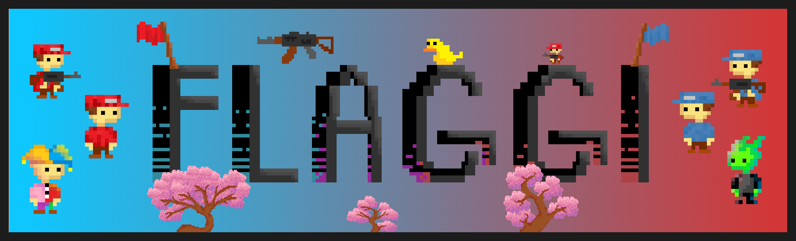

# FLAGGI

> **This project is currently in active development.** Features may be incomplete, unstable, or subject to change. Version 2.0 is a ground-up rewrite and is not yet feature-complete.

A real-time multiplayer 2D capture-the-flag game built in Java. Players battle across rooms, shoot bullets, capture enemy flags, and race to outscore the opposing team. The game uses a custom TCP + UDP networking stack for low-latency state synchronization and client-side movement prediction for a responsive feel.

All sprites were made by **[@Snapshot20](https://github.com/Snapshot20)**.

---

## Gameplay

- **Capture the Flag** — collect the enemy team's flag and return it to score points
- **Combat** — shoot bullets to eliminate opponents; kills reward your team
- **Teams** — players are split into red and blue teams; each has their own flag
- **Skins** — four selectable character skins: Blue, Red, Jester, Venom
- **Stats** — kills, deaths, wins, and losses are tracked per player in a database

Players move with the keyboard and aim/shoot with the mouse. The game world includes static obstacles (trees) that provide cover and affect movement.

---

## Architecture

Multi-module Gradle project:

```
flaggi/
  client/       Java Swing game client
  server/       Game server (TCP + UDP)
  shared/       Shared utilities, protobuf definitions, game object models
  editor/       Map/level editor (work in progress, currently disabled)
  dev-console/  Electron app for launching client & server during development
  scripts/      Build and packaging helpers
```

### Client

The client is a Java Swing desktop application. Key components:

- **GameUi** — main game renderer; handles camera, zoom, sprite drawing, and the game HUD
- **GameManager** — manages game state, player input, and client-side movement prediction
- **Sprite** — tick-based sprite animation system; supports animated (walking/idle) and static sprites
- **TcpManager / UdpManager** — handles the two-channel network connection to the server

The camera keeps the local player centered on screen at all times. The world is rendered at 0.5× zoom. Player sprites are cached by username and flipped horizontally when facing left.

### Server

The server handles all authoritative game logic:

- **TCP** (via Javalin) — handshakes, lobby invites, game start/end signals
- **UDP** — high-frequency game state broadcasts (`ServerStateUpdate`) with positions, animations, HP, and flag counts for every object in the game world
- **DatabaseManager** — SQLite database recording players, games, and per-game stats
- **GameManager** — server-side physics, AABB collision detection, bullet simulation, flag pickup/drop logic

### Shared

Code used by both client and server:

- Protobuf definitions (`client-messages.proto`, `server-messages.proto`)
- Game object models (`GameObject`, `PlayerGameObject`, `BulletGameObject`, `FlagGameObject`, `Hitbox`)
- Utilities: `Logger`, `FileUtil`, `ImageUtil`, `FontUtil`, `ScreenUtil`, `NetUtil`, `ProtoUtil`
- Rendering base: `VhGraphics`, `GPanel`, `UpdateLoop`

---

## Networking

The game uses two channels per connected client:

| Channel | Protocol | Purpose |
|---------|----------|---------|
| Control | TCP (HTTP/WebSocket via Javalin) | Handshake, lobby management, game events |
| Game state | UDP | Per-frame player input (client → server) and world state (server → client) |

On connect, the server issues a UUID and UDP port to the client (`ServerHello`). From that point, game updates flow over UDP for minimal latency.

**Client → Server (UDP, per frame):**
```
ClientStateUpdate {
  playerUuid, gameUuid,
  mouse position,
  keys held (UP, DOWN, LEFT, RIGHT, SHOOT)
}
```

**Server → Client (UDP, per frame):**
```
ServerStateUpdate {
  me: ServerGameObject (local player),
  other: [ServerGameObject, ...] (all other objects),
  tick
}
```

---

## Sprites

All game sprites were created by **[@Snapshot20](https://github.com/Snapshot20)**.

Sprites live under `client/src/main/resources/sprites/`:

```
player-blue/
  idle/          0.png, 1.png, ...
  walk-up/       0.png, 1.png, ...
  walk-down/     0.png, 1.png, ...
  walk-side/     0.png, 1.png, ...
  walk-diagonal/ 0.png, 1.png, ...
player-red/      (same structure)
player-jester/   (same structure)
player-venom/    (same structure)
flag-blue/       flag-blue.png
flag-red/        flag-red.png
tree/            tree.png
bullet/          bullet.png
```

Sprites are loaded by the `Sprite` class using `FileUtil.listResourceFiles`, which supports both direct filesystem access (development) and loading from inside a built JAR (production).

---

## Tech Stack

| Category | Technology |
|----------|-----------|
| Language | Java 21 |
| Build | Gradle 8 (Kotlin DSL) |
| Networking | TCP via Javalin 6.7.0 + custom UDP |
| Serialization | Protocol Buffers v3 |
| Database | SQLite (JDBC) |
| UI | Java Swing / AWT Graphics2D |
| Dev console | Electron 28 |
| Packaging | jlink + jpackage + create-dmg (macOS) / WiX 3 (Windows) |
| CI | GitHub Actions |

---

## Getting Started

### Requirements

- Java 21
- Gradle (or use the `./gradlew` wrapper)
- Node.js + npm (for the dev console only)
- `create-dmg` (for macOS packaging only — `brew install create-dmg`)
- WiX 3 (for Windows packaging only — see package section below)

### Compile check

```bash
./gradlew :shared:compileJava :client:compileJava :server:compileJava
```

### Run (development)

The recommended way to run the game during development is through the **dev console**:

```bash
cd dev-console
npm install
npm start
```

This opens an Electron app that lets you launch the client and server with a single click and displays their logs in real time.

Alternatively, use the run script directly:

```bash
# Start the server
scripts/run.sh server

# Start a client (in a separate terminal)
scripts/run.sh client
```

The script builds a shadowJar automatically before launching. Pass `--rebuild` (or `-r`) to force a rebuild.

### Package for macOS

```bash
scripts/package.sh client
```

Produces a `.dmg` installer with an embedded diet JRE (via jlink + jpackage + create-dmg). The file is written to `dist/`. Requires `create-dmg` (`brew install create-dmg`).

### Package for Windows

```bash
scripts/package.sh client
```

Produces a `.exe` installer with an embedded diet JRE (via jlink + jpackage + WiX 3). The file is written to `dist/`. Requires:

- [WiX 3](https://github.com/wixtoolset/wix3/releases/latest) — jpackage does **not** support WiX 4+
- `JAVA_HOME` and `WIX` set as system environment variables

---

## Development Container

A fully configured Docker-based dev environment is included in `.devcontainer/`. It provides:

- OpenJDK 21
- Protobuf compiler
- Gradle
- Clang / clang-format
- ktlint
- All VSCode extensions pre-configured

Open the project in VSCode and use **Dev Containers: Reopen in Container** to get started instantly.

---

## Database

The server persists game history in a local SQLite database:

```
players         — name, total kills/deaths/wins/losses, first/last seen
games           — winner team, duration, timestamp
player_game_stats — per-player per-game breakdown (team, kills, deaths, won)
```

---

## License

MIT — see [LICENSE](./LICENSE).
